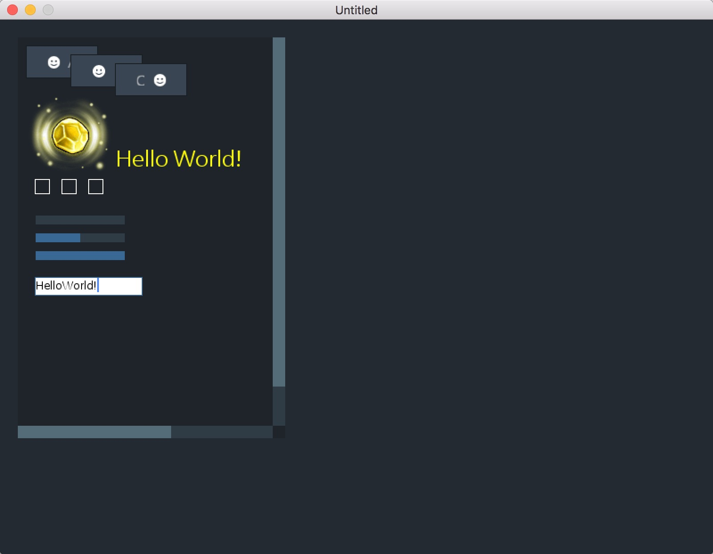

[](https://996.icu)

# catui
A very light-weight GUI framework for the Löve2D

## LOVE Version
11.0+

## What do I want in my GUI library?
+ Simple
+ Light-weight
+ Extensible
+ Rich events

## Explain
You should expand your own control, but you can also use the control folder under the control

## Example
```
require "catui"

local myBtn = UIControl:new()
myBtn:setPos(100, 100)
myBtn:setSize(100, 40)

myBtn.events:on(UI_DRAW, function()
    local box = self:getBoundingBox()
    local x, y = box.left, box.top
    local w, h = box:getWidth(), box:getHeight()
    love.graphics.setColor(0, 1, 0, 1)
    love.graphics.rectangle(x, y, w, h)
end, myBtn)

myBtn.events:on(UI_CLICK, function()
    print("my buton is click")
end)

UIManager:getInstance().rootCtrl.coreContainer:addChild(myBtn)
```

## API DOC
[Goto Read](http://htmlpreview.github.io/?https://github.com/wilhantian/catui/blob/master/doc/index.html)

## Screenshot


## License [](https://github.com/996icu/996.ICU/blob/master/LICENSE)
    
    Copyright (c) 2019 田伟汉

    "Anti 996" License Version 1.0 (Draft)

    Permission is hereby granted to any individual or legal entity
    obtaining a copy of this licensed work (including the source code,
    documentation and/or related items, hereinafter collectively referred
    to as the "licensed work"), free of charge, to deal with the licensed
    work for any purpose, including without limitation, the rights to use,
    reproduce, modify, prepare derivative works of, distribute, publish
    and sublicense the licensed work, subject to the following conditions:

    1. The individual or the legal entity must conspicuously display,
    without modification, this License and the notice on each redistributed
    or derivative copy of the Licensed Work.

    2. The individual or the legal entity must strictly comply with all
    applicable laws, regulations, rules and standards of the jurisdiction
    relating to labor and employment where the individual is physically
    located or where the individual was born or naturalized; or where the
    legal entity is registered or is operating (whichever is stricter). In
    case that the jurisdiction has no such laws, regulations, rules and
    standards or its laws, regulations, rules and standards are
    unenforceable, the individual or the legal entity are required to
    comply with Core International Labor Standards.

    3. The individual or the legal entity shall not induce, suggest or force
    its employee(s), whether full-time or part-time, or its independent
    contractor(s), in any methods, to agree in oral or written form, to
    directly or indirectly restrict, weaken or relinquish his or her
    rights or remedies under such laws, regulations, rules and standards
    relating to labor and employment as mentioned above, no matter whether
    such written or oral agreements are enforceable under the laws of the
    said jurisdiction, nor shall such individual or the legal entity
    limit, in any methods, the rights of its employee(s) or independent
    contractor(s) from reporting or complaining to the copyright holder or
    relevant authorities monitoring the compliance of the license about
    its violation(s) of the said license.

    THE LICENSED WORK IS PROVIDED "AS IS", WITHOUT WARRANTY OF ANY KIND,
    EXPRESS OR IMPLIED, INCLUDING BUT NOT LIMITED TO THE WARRANTIES OF
    MERCHANTABILITY, FITNESS FOR A PARTICULAR PURPOSE AND NONINFRINGEMENT.
    IN NO EVENT SHALL THE COPYRIGHT HOLDER BE LIABLE FOR ANY CLAIM,
    DAMAGES OR OTHER LIABILITY, WHETHER IN AN ACTION OF CONTRACT, TORT OR
    OTHERWISE, ARISING FROM, OUT OF OR IN ANY WAY CONNECTION WITH THE
    LICENSED WORK OR THE USE OR OTHER DEALINGS IN THE LICENSED WORK.

    The MIT License (MIT)

    Copyright (c) 2016 WilhanTian  田伟汉

    Permission is hereby granted, free of charge, to any person obtaining a copy
    of this software and associated documentation files (the "Software"), to deal
    in the Software without restriction, including without limitation the rights
    to use, copy, modify, merge, publish, distribute, sublicense, and/or sell
    copies of the Software, and to permit persons to whom the Software is
    furnished to do so, subject to the following conditions:

    The above copyright notice and this permission notice shall be included in all
    copies or substantial portions of the Software.

    THE SOFTWARE IS PROVIDED "AS IS", WITHOUT WARRANTY OF ANY KIND, EXPRESS OR
    IMPLIED, INCLUDING BUT NOT LIMITED TO THE WARRANTIES OF MERCHANTABILITY,
    FITNESS FOR A PARTICULAR PURPOSE AND NONINFRINGEMENT. IN NO EVENT SHALL THE
    AUTHORS OR COPYRIGHT HOLDERS BE LIABLE FOR ANY CLAIM, DAMAGES OR OTHER
    LIABILITY, WHETHER IN AN ACTION OF CONTRACT, TORT OR OTHERWISE, ARISING FROM,
    OUT OF OR IN CONNECTION WITH THE SOFTWARE OR THE USE OR OTHER DEALINGS IN THE
    SOFTWARE.
